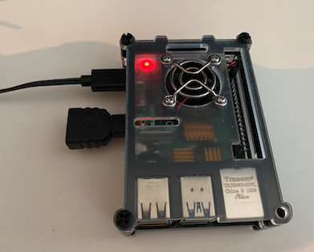
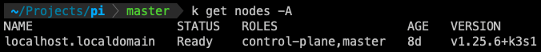
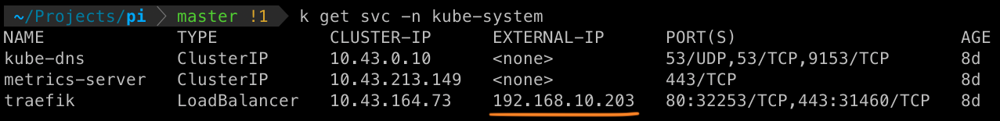
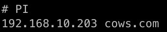

This project deploys an application onto a **k3s cluster** running on my bare metal Raspberry PI 4B. 

Well, not completely bare metal, I have installed AlmaLinux as the OS on this bare metal, on top of which I installed k3s & running a one-node cluster there. (In near future, when I received my 2nd PI, I will setup a multi-node cluster on bare metal PIs)  


The single PI node:


The purpose of this project is to demonstrate how we could decouple the TLS certificate management from Ingress Controller (e.g. Traefik). This strategy can be applied to **k3s**, **k8s** clusters running on-premises or cloud hosted.

The benefits are:

- With a deployed k8s/k3s cluster, if needed to swtich to a different Ingress Controller, we would not need to re-issue the TLS certificates for applications running in the cluster.

- TLS certificates can be automatically renewed with the use of [Cert-manager](https://cert-manager.io)

# TLS
(The `/SSL` directory is only for experimental purpose only! It can be deleted.)

This project uses [Cert-manager](https://cert-manager.io/docs/) to manage TLS certificate for TLS traffic enabling.

Deploying in the following order:
1. cert-mgr/cert-manager.yaml
2. cert-mgr/issuer-<stg/prod>.yaml
3. ingress/ingress.yaml
4. Depending on whether the "issuer" annotation mentioned below is enabled or not, deciding whether deploys Certificate yaml.

Deploy the demo app by:
`k apply -f demo-app-depl.yaml`

The `Traefik` **Ingress Controller** associated **Load Balancer** service receives an external IP: 


Mapping the external IP with a hostname in `/etc/hosts` on my MacBook, after which, I can access the application via https://cows.com :



#### To check the live logs of cert-manager pod
`> k logs -n cert-manager -f <cert-manager pod name>`

## The issuer annotation in Ingress
In `ingress/ingress.yaml`, there is the annotation for the issuer:
```
metadata:
  annotations:
    ...
    cert-manager.io/issuer: "letsencrypt-staging"
```
### If disabled this annotation

At the moment, this annotation is disabled, instead, there are Certificate yaml files under `cert-mgr/` directory: `certificate-stg`, `certificate-prod`. Using this Certificate manifest, I can explicitly configure the desired certificate.

After deployed the ingress, we have to deploy the certificate.


### If enabled this annotation

With this annotation, we don't need to use the Certificate yaml. Our ingress takes advantage of `ingress-shim` to have it create the `certificate` resource on our behalf. 

After creating a `certificate`, the `cert-manager` will update or create a `ingress` resource and use that to validate the domain. 

Once verified and issued, `cert-manager` will create or update the `secret` defined in the certificate. This `secret` name is specified in the `ingress/ingress.yaml`'s `spec.tls` like this:
```
...
spec:
  tls:
  - secretName: my-tls-secret-for-cert
```

So, `cert-manager` will create a secret with this name after this ingress is deployed.